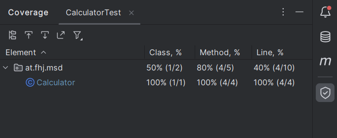
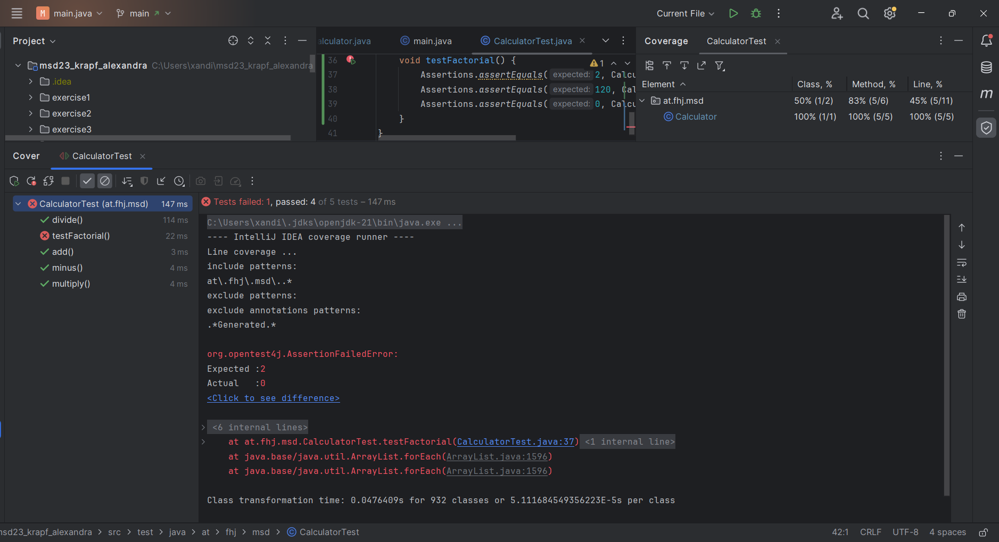

### Verwendete Testcases
- Addition mit positiven Zahlen
- Addition mit negativen Zahlen
- Addition mit Dezimalzahlen
- Subtraktion mit positiven Zahlen
- Subtraktion mit negativen Zahlen
- Subtraktion mit Dezimalzahlen
- Division mit positiven Zahlen
- Division mit negativen Zahlen
- Division mit Dezimalzahlen
- Multiplikation mit positiven Zahlen
- Multiplikation mit negativen Zahlen
- Multiplikation mit Dezimalzahlen
 
 

