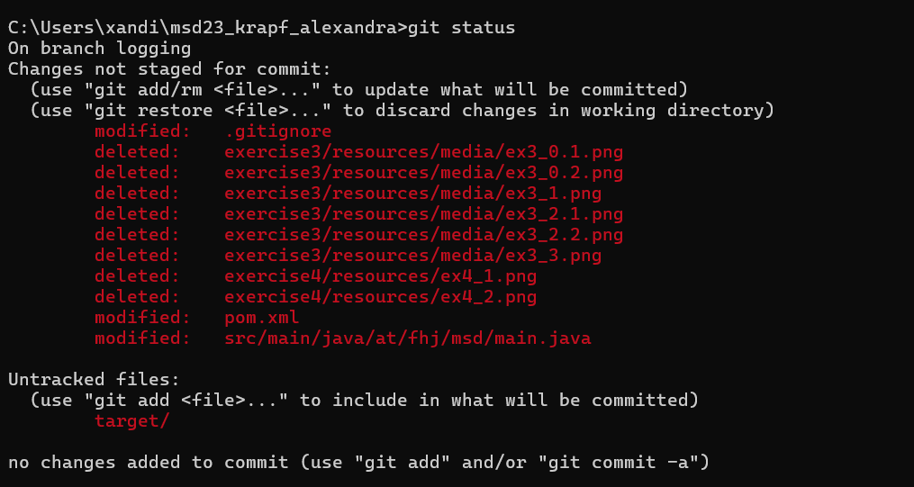
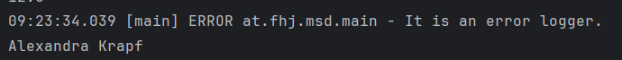
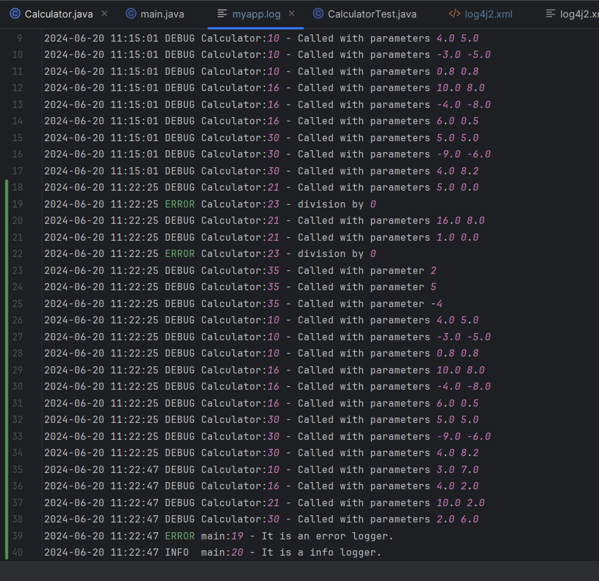
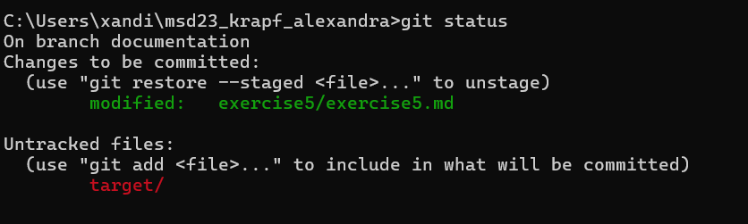

# Exercise 5 - Branching

### Warum werden Logging Bibliotheken verwendet?
Logging Bibliotheken werden verwendet für...
#### ...Fehlerbehebung und Debugging
Logs bieten eine detaillierte Aufzeichnung von Fehlermeldungen und Ausnahmefällen, die während der Ausführung einer Anwendung auftreten. Dies hilft Entwicklern, die genaue Ursache eines Problems zu identifizieren.  
Logs können verwendet werden, um den Ablauf der Anwendung zu verfolgen und den Zustand des Systems zu verschiedenen Zeitpunkten zu überprüfen. (Debugging)
#### ...Überwachung und Wartung
Durch das Protokollieren von Betriebsinformationen können Entwickler und Systemadministratoren den Zustand und die Leistung der Anwendung überwachen. 
Logs können dazu beitragen, potenzielle Probleme frühzeitig zu erkennen und zu beheben, bevor sie zu größeren Ausfällen führen.
#### ...Audit und Sicherheit
Protokollnachrichten können sicherheitsrelevante Ereignisse aufzeichnen, wie z.B. unautorisierte Zugriffsversuche, um Sicherheitsverletzungen zu erkennen und zu analysieren.
#### ...Analyse und Reporting
Logs können wertvolle Daten für die Analyse des Benutzerverhaltens und der Systemnutzung liefern.
#### ...Wartbarkeit und Diagnose
 Langfristige Protokollierung ermöglicht die Analyse von Trends und Mustern im Systemverhalten, was bei der Optimierung und Verbesserung der Anwendung hilfreich ist. 

#### ...Flexibilität und Konfigurierbarkeit
Logging-Bibliotheken ermöglichen es, die Granularität der Protokollierung durch verschiedene Log-Ebenen (DEBUG, INFO, WARN, ERROR, FATAL) anzupassen.

### Welche Loglevel gibt es in Log4J und was hat es damit auf sich?
#### TRACE
Das detaillierteste Loglevel. Es wird verwendet, um feingranulare Informationen über den Ablauf der Anwendung zu protokollieren. 
Nützlich für sehr detailliertes Debugging, um den genauen Ablauf des Programms zu verfolgen.
#### DEBUG
Wird verwendet, um Informationen zu protokollieren, die für das Debuggen der Anwendung hilfreich sind. 
 Geeignet für die Entwicklung und Fehlerbehebung, um den Zustand der Anwendung und ihrer Variablen zu überprüfen.
 #### INFO
 Informative Nachrichten, die den normalen Betrieb der Anwendung beschreiben. 
 Geeignet für allgemeine Betriebsinformationen, die den Fortschritt der Anwendung zeigen, z.B. der erfolgreiche Start eines Services.
 #### WARN
 Warnt vor potenziell schädlichen Situationen. 
 Hinweise auf mögliche Probleme, die nicht unbedingt einen Fehler darstellen, aber beachtet werden sollten.
 #### ERROR
 Zeigt Fehler an, die die Anwendung beeinträchtigen, aber nicht zum Absturz führen. 
 Protokolliert schwerwiegende Probleme, die behoben werden müssen, aber die Anwendung kann weiterlaufen, z.B. Probleme beim Zugriff auf eine Datenbank.
 #### FATAL
 Zeigt sehr schwere Fehler an, die wahrscheinlich dazu führen, dass die Anwendung abstürzt. 
 Kritische Fehler, nach denen die Anwendung möglicherweise nicht weiterarbeiten kann.

 ### Was für Konfigurationsmöglichkeiten bietet Ihnen log4J?
 - Konfigurationsdateiformate (XML, JSON, YAML, Properties)
 - Log-Ebenen 
 - Logger (Definieren von Loggern für verschiedene Teile der Anwendung.)
 - Appender
 - Layouts
 - Filter 
 - Properties

 

 

 

 