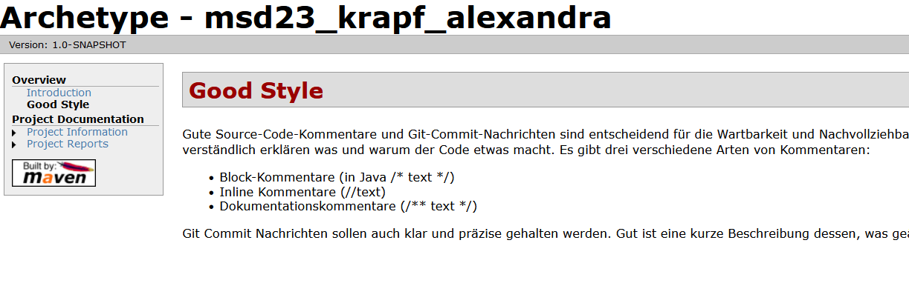
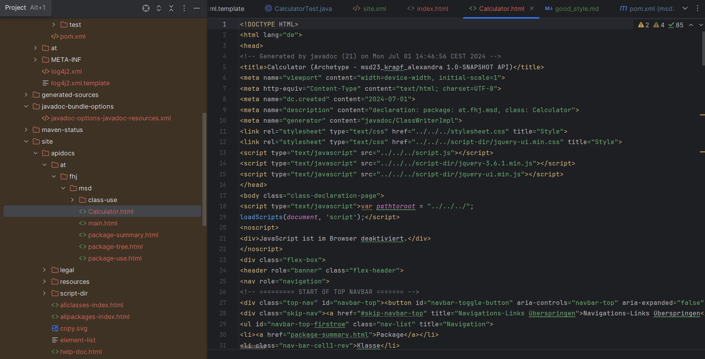
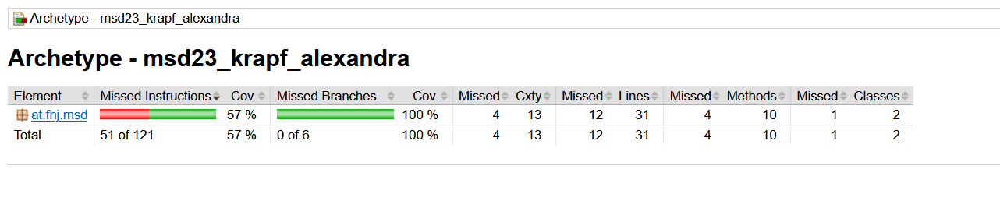

# Exercise 6 - Documentation

### Was ist notwendig um Maven Site Dokumentation zu generieren?
1. Das Maven Site Plugin muss zum pom.xml hinzugefügt werden. Dies ist das zentrale Plugin zur Generierung der Site.
2. Das maven-javadoc-plugin muss konfiguriert sein, um die Javadoc-Dokumentation zu generieren.
3. Zusätzliche Plugins werden hinzugefügt , um Berichte wie Testberichte, Codeabdeckungsberichte usw zu generieren. 
4. Es könne noch optionale Konfigurationen vorgenommen werden, um das Aussehen und den Inhalt der Site anzupassen

### Welche unterschiedlichen Aspekte, Konfigurationen, Informationen, usw. werden in site.xml bzw. pom.xml konfiguriert?
**pom.xml:**
Enthält Projektinformationen, Build- und Reporting-Konfigurationen, Abhängigkeiten und Distribution Management und steuert den gesamten Build-Prozess und die Einbeziehung von Berichten und Dokumentationen in die generierte Site.

**site.xml:**
Steuert Layout, die Navigation und das Erscheinngsbild der generierten Projektwebsite, definiert Menüs, Untermenüs und unterstützte Skins und Internationalisierung. 

### Screenshots good_style, API und jacoco

